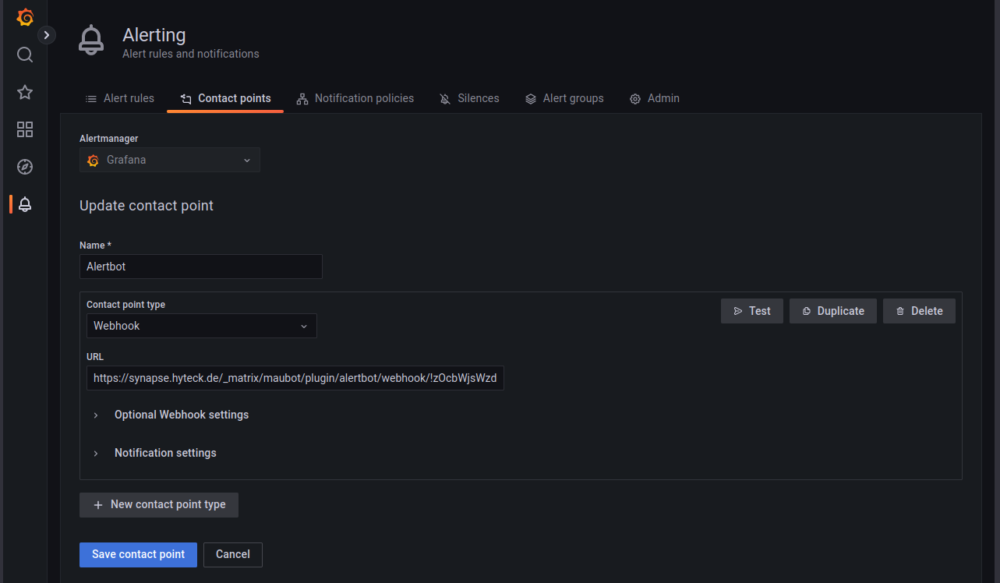

# Alertbot

This bot uses the webhook functionality of monitoring/alerting solutions like Grafana or Alertmanager to forward alerts to matrix rooms.
This means that you no longer have to use E-Mail or Slack to receive alerts. 

## Getting Started

You can either [invite](#invite-the-official-instance) an official instance of the bot, or [self-host](#self-host-an-instance) it on your own matrix server.

## Invite the Official Instance

* Create a Matrix room and invite @alertbot:hyteck.de
* Send `!url` to the room. The bot will answer with the webhook URL
* Put the Webhook URL into your monitoring solution (see below)

## Self-host an Instance

**Prerequisites:**
* A Matrix server where you have access to a maubot instance
   * Refer to the [docs](https://docs.mau.fi/maubot/usage/setup/index.html) for setting up one
   * or use [spantaleev/matrix-docker-ansible-deploy](https://github.com/spantaleev/matrix-docker-ansible-deploy/blob/master/docs/configuring-playbook-bot-matrix-registration-bot.md) which has built-in maubot support
* An instance of alertmanager or grafana or a similar alerting program that is able to send webhooks

**Build the Bot**

The bot is built using the maubot command line tool `mbc`, you can either build it locally or remotely.

Build it locally, and afterwards navigate to the Maubot Administration Interface and upload the .mpb file.
```shell
pip install maubot
git clone https://github.com/moan0s/alertbot
cd alertbot
mbc build
```

It's possible to upload the build to you maubot instance from the CLI. This is especially helpful when developing.
First login to your instance, then add the `-u` flag to upload after build.
```shell
mbc login
mbc build -u
```

**Configure the Bot**

Next, once the plugin is installed, set up a [client](https://docs.mau.fi/maubot/usage/basic.html#creating-clients) and then create an [instance](https://docs.mau.fi/maubot/usage/basic.html#creating-instances) which connects the client and plugin. 

Finally, invite the bot to an encrypted room where alerts should be sent and query the bot for the room id with the command `!roomid`.

## Setup Alertmanager

This configuration will send all your alerts to the room `!zOcbWjsWzdREnihgeC:example.com` (if the bot has access to it).
Put in your own room-id (`!roomid`) behind the webhook base url (`!url`):
```yaml

receivers:
- name: alertbot
  webhook_configs:
  - url: https://synapse.hyteck.de/_matrix/maubot/plugin/alertbot/webhook/!zOcbWjsWzdREnihgeC:example.com
route:
  group_by:
  - alertname
  - cluster
  - service
  group_interval: 5m
  group_wait: 30s
  receiver: alertbot
  repeat_interval: 3h

```

## Setup Grafana

The grafana setup is fairly simple and can be used to forward grafana alerts to matrix.



## Send Test Alerts

Use an example from the `alert_examples/` to test your setup
```shell
curl --header "Content-Type: application/json" \
  --request POST \
  --data "@alert_examples/prometheus.json" \
  https://webhook.example.com/_matrix/maubot/plugin/maubot/webhook/!zOcbWjsWzdREnihreC:example.com
```

## Matrix Room

This project has a dedicated [chat room](https://matrix.to/#/#alertbot:hyteck.de)
